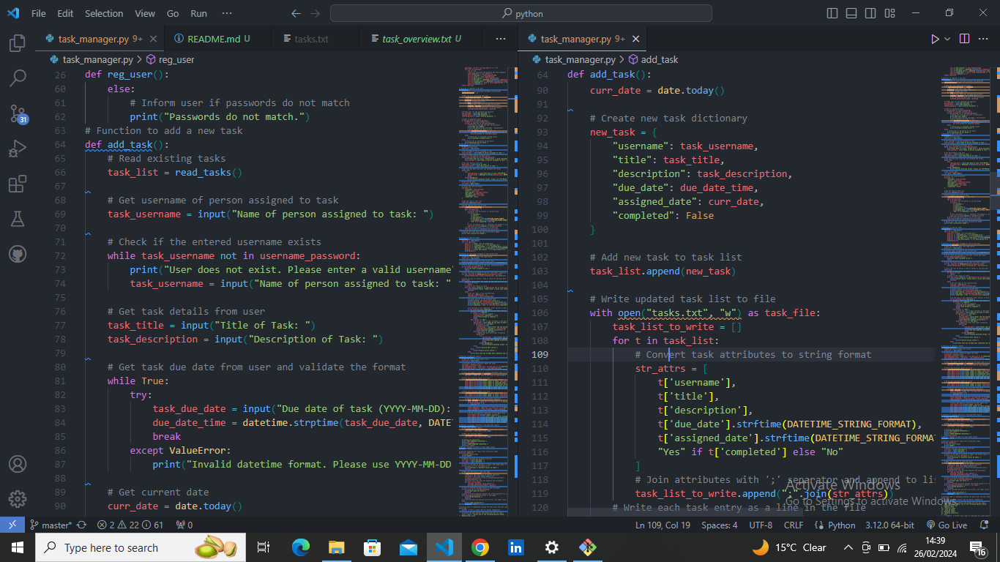

# Task Manager

## Description
The Task Manager is a project aimed at helping individuals or teams organize and manage their tasks effectively. It provides a user-friendly interface for creating, assigning, and tracking tasks, ensuring efficient task management and collaboration.

## Table of Contents
- [Installation](#installation)
- [Usage](#usage)
- [Credits](#credits)

## Installation
To run the Task Manager project locally, follow these steps:
1. Clone the repository to your local machine using `git clone https://github.com/your-chalajemal/task_manager.git`.
2. Navigate to the project directory.
3. Install any necessary dependencies by running `npm install` or `pip install -r requirements.txt`, depending on the project's tech stack.

## Usage
Once the project is installed locally, you can follow these instructions to use it:
1. Run the application by executing `python app.py` or `npm start`, depending on the project setup.
2. Open your web browser and navigate to `http://localhost:8000` (or the appropriate URL).
3. You'll be prompted to log in with your username and password.
4. After logging in, you can perform various actions such as adding tasks, viewing all tasks, viewing tasks assigned to you, generating reports, etc.
5. Follow the on-screen instructions or prompts to navigate through the application and utilize its features.

### Screenshots

*Caption for Screenshot 1*

*Caption for Screenshot 2*

## Credits
The Task Manager project was created and maintained by [Chala Jemal](https://github.com/chalajemal) and [Chala Jemal](https://github.com/chalajemal).

